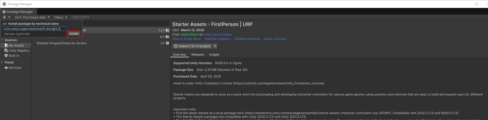
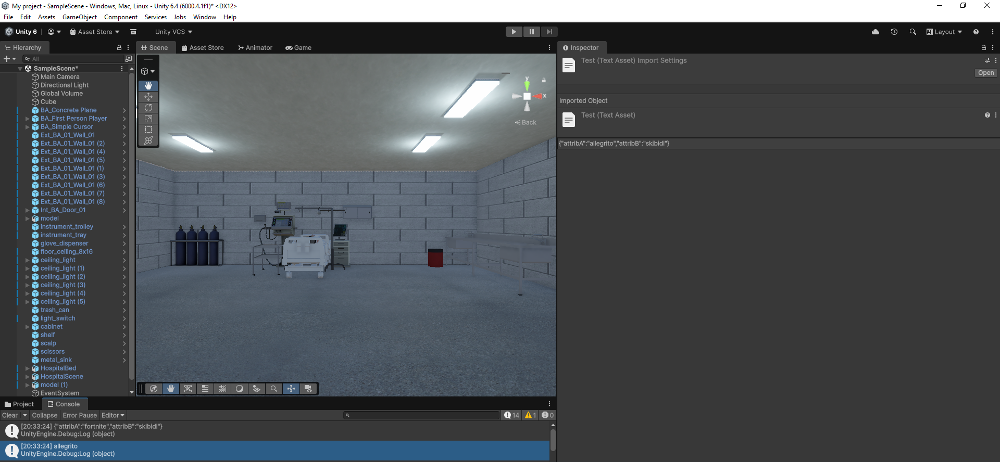

# Iosif Branch &rarr; Decision Tree Experiment Branch
Το παρόν branch παρουσιάζει μερικές αλλάγες σε σύγκριση με άλλα:
- Με χρήση του πλήκτρου E επί του μονιτορ, αναπαριστόνται τυχαία νούμερα **για τους καρδιακούς παλμούς**, όπως είχε πραγματοποιηθεί πρίν το πέρας του εξαμήνου. 
- Σημειώνεται επίσης **μια πρώιμη χρήση του Newtonsoft.Json πακέτου** για το οποίο κληθήκαμε να ασχοληθούμε έγω (Ιωσήφ) και ο Πάνος.

Αν υπάρχουν περαιτερώ θέματα με τα Decision Trees, παρακαλείστε να τα αναφέρετε στο **ανάλογο issue** που έχει δημιουργηθεί.

# Χρήση Newtonsoft.Json 
To Newtonsoft.Json για το Unity είναι μια δωρέαν επέκταση του Unity που επιτρέπει την αποθήκευση της κατάστασης των αντικειμένων σε μορφή κειμένου μεσω παράθεσης χαρακτηριστικών (**serialization**) αλλά και την αντίθετη διαδικασία (**deserialization**). Για να λειτουργήσει, ακολουθούμε κάποια βήματα. 

## Βήμα 1. Εγκατάσταση Επέκτασης
Για να εγκαταστήσουμε την επέκταση, πατάμε στην πάνω μπάρα μενού το κουμπί Asset Store και εκεί επιλέγουμε **My Assets**. Ύστερα, πατάμε το + που βρίσκεται πάνω αριστερά και επιλέγουμε την επιλογή "Install package by technical name". Ως ονομασία ζητούμενη αντιγράψτε και επικολλήστε το εξής: com.unity.nuget.newtonsoft-json@3.2. <br> 
<br>
Μετά, πατάτε "Install" ή "Εγκατάσταση".

## Βήμα 2. Serialization και Deserialization
Για να κάνουμε serialize κάτι μπορούμε να χρησιμοποιήσουμε μερικές εντολές όπως τις κάτωθι:
```c#
using Newtonsoft.Json;
        var json_txt=""; // Έστω ότι το json_txt είναι ένα άδειο string
        DataInfo info = new DataInfo(); // Κάθε αντικείμενο της C# έχει by default έναν
        // default κονστρακτορά ο οποίος δημιουργεί ένα αντικείμενο (object) μιας κλάσης.

        // Ανακαλώντας γνώσεις C++, ένα αντικείμενο είναι απλά ένα snapshot μιας κλάσης ,
        // δηλαδή μιας αφηρημένης περιγραφής.
        info.attribA = "fortnite";
        info.attribB = "skibidi";

        json_txt = JsonConvert.SerializeObject(info);
        return json_txt;

```

Η εντολή `JsonConvert.SerializeObject()` λαμβάνει το όρισμα και φροντίζει να το κάνει serialize.

Για το deserialize:

```c#
         JsonConvert.DeserializeObject<DataInfo>(json);
``` 

Η εντολή `JsonConvert.DeserializeObject<TypeOfObject>(json πραγμα)` λαμβάνει το όρισμα και φροντίζει να το κάνει deserialize.

## Βήμα 3. Δημιουργία ενός Λειτουργικού Παραδείγματος
Τώρα θα σημειώσουμε πως πραγματοποιείται ένα λειτουργικό παράδειγμα, εξηγώντας ανά τμήματα τον κώδικα του αρχείου JSONToObject.cs, το οποίο μπορεί να βρεθεί εδώ. 

Για αρχή, σημειώνουμε τις βιβλιοθήκες.

```c#
    using UnityEngine;
    using System.Collections;
    using System.Collections.Generic;
    using Newtonsoft.Json;
    using System.IO;  
```
Οι πρώτες 3 είναι βασικές του Unity, αλλά μας ενδιαφέρουν οι επόμενες 2. Η βιβλιοθήκη **Newtonsoft.Json** είναι η βιβλιοθήκη που αναφέραμε, ενω η **System.IO** θα μας βοηθήσει με την φόρτωση ή αποθήκευση σε κάποιου είδους αρχείο .json ώστε να προβληθεί μια πιο πρακτική όψη των δυνατότητων της βιβλιοθήκης.

Συνεχίζοντας, έχουμε τον ορισμό του ίδιου του σεναρίου. 

```c#
public class JSONToObject : MonoBehaviour
{
    // Start is called once before the first execution of Update after the MonoBehaviour is created
    void Start()
    {
        var txt = GetJSONText();
        Debug.Log(txt);
        /*
        var info = JSON2Object(txt);
        Debug.Log(info.attribA);
        */

        // Try to load a file
        var info_from_file = JSON2Object(File.ReadAllText("./Assets/test.json"));
        Debug.Log(info_from_file.attribA);
    }
```

Η ```Debug.Log();``` αποτελεί συνάρτηση η οποία εκτυπώνει το όρισμα της στην κονσόλα του Unity, ενώ θα περιγραφούν ύστερα οι συναρτήσεις ```GetJSONText()``` και ```JSON2Object()```. Η ```File.ReadAllText()``` λαμβάνει το όνομα ενός αρχείου στον παρόν κατάλογο, μια σχετική διαδρομή, ή μια απόλυτη διαδρομή προς κάποιο αρχείο, και επιστρέφει το κείμενο του. <br>

Μετά, ορίζεται η ```GetJSONText```.

```c#
    public string GetJSONText()
    {
        var json_txt=""; // Έστω ότι το json_txt είναι ένα άδειο string
        DataInfo info = new DataInfo(); // Κάθε αντικείμενο της C# έχει by default έναν
        // default κονστρακτορά ο οποίος δημιουργεί ένα αντικείμενο (object) μιας κλάσης.

        // Ανακαλώντας γνώσεις C++, ένα αντικείμενο είναι απλά ένα snapshot μιας κλάσης ,
        // δηλαδή μιας αφηρημένης περιγραφής.
        info.attribA = "fortnite"; // Μπορείτε να αφήσετε αυτά κενά αλλά εδώ είχαν πρώτα χρησιμοποιηθεί προς δοκιμή των βιβλιοθηκών.
        info.attribB = "skibidi";

        json_txt = JsonConvert.SerializeObject(info);
        // File.WriteAllText("./Assets/test.json",json_txt); // Εδώ θα γράψουμε serialization , κάντε uncomment αν θέλετε να αποθηκεύσετε στο αρχείο αλλά οχι να φορτώσετε
        return json_txt;
    }
```

Το μόνο που είναι άξιο να σημειώσουμε είναι πως τα χαρακτηριστικά που θέλουμε να αντλήσουμε/αποθηκεύσουμε βρίσκονται σε μια άλλη κλάση ονόματι ```DataInfo``` βάσει ενός σχετικού tutorial, αλλά μπορούμε να τα αποθηκεύσουμε και αλλού. <br>

Ύστερα, παρατηρήστε την ```JSON2Object()``` συνάρτηση και τον ορισμό της.

```c#
    public DataInfo JSON2Object(string json)
    {
        return JsonConvert.DeserializeObject<DataInfo>(json);
    }
```

Τέλος, η ίδια η κλάση.
```c#
[System.Serializable]
    public class DataInfo
    {
       // public string json;
       public string attribA;
       public string attribB;

    }
```

## Βήμα 4. Αποτελέσματα
Έστω τα παρακάτω δεδομένα σε ενα αρχείο json
```json
{"attribA":"allegrito","attribB":"skibidi"}
```

Με τον δοθέν κώδικα, τα αποτελέσματα είναι αυτά της παρακάτω εικόνας.



# Λοιπές Παρατηρήσεις
Από τη συγγραφή αυτού του εγγράφου κι ύστερα μπορεί να έχουν υπάρξει παράλληλα σκριπτάκια που να λειτουργούν διαφορετικά ή επιπλέον στοιχεία που να επηρεάζονται από λειτουργίες της βιβλιοθήκης αυτής. **Παρακαλείστε να δοκιμάσετε και μόνοι σας το έργο Unity εντός αυτού του branch**, ώστε να εξοικειωθείτε και εσείς με τις εντολές αυτές (συγκεκριμένα δώστε έμφαση στο σενάριο **JSONUseObject.cs**).